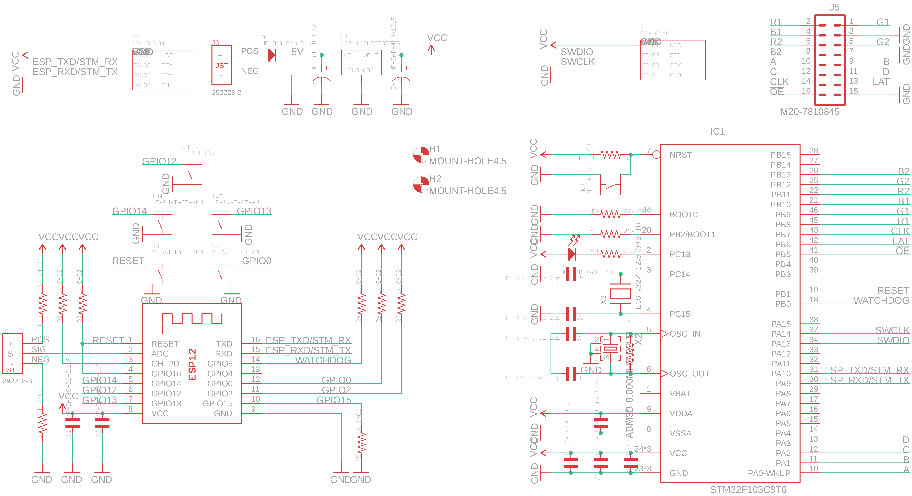
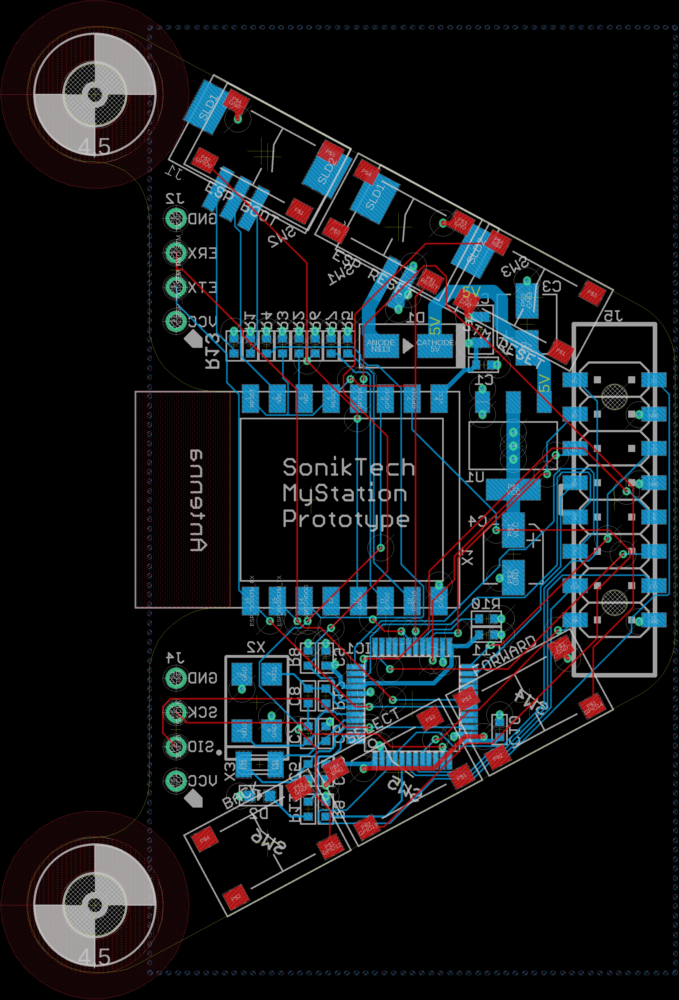

# subway-timetable
A "Times Square" colorful LED display that shows you your favorite subway's status

Up to date info about your subway line and its arrival time for your station

I wanted to use one of those super colorful 32 x 64 RGB LED "times square" modules to display the subway schedule of the train nearest to me.

Still a work in progress, but the hardware is ready and the firmware works :)

